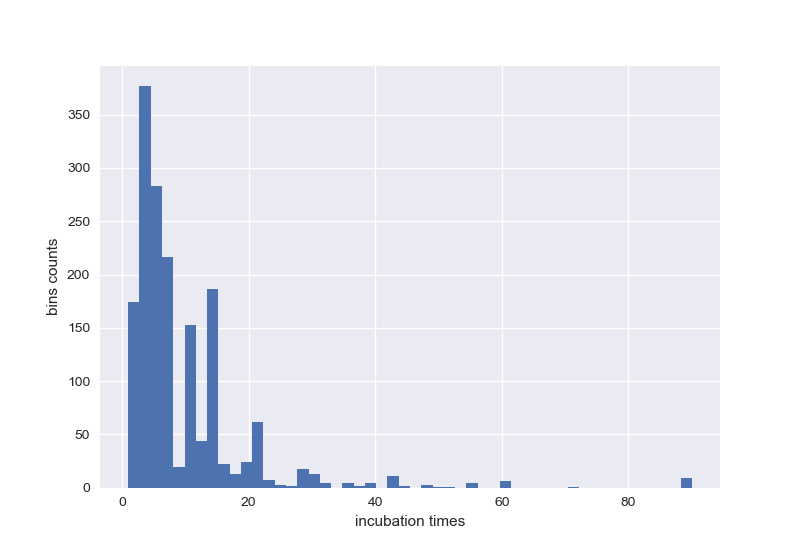

# covid_19_data_analysis
### text analysis to find the mean of incubation of the virus in all paper talks about it in the past

first you need to download the data files. I suggest to download it from kaggle and extract it in the directory as the python file is 
the link to the data is https://www.kaggle.com/allen-institute-for-ai/CORD-19-research-challenge/download
download it as extract it as shown above

### incubation times mean histgram

#### The incubation mean is about: 10.983 days
##### most of this work is based on a youtube video of sentdex channel https://www.youtube.com/watch?v=S6GVXk6kbcs
